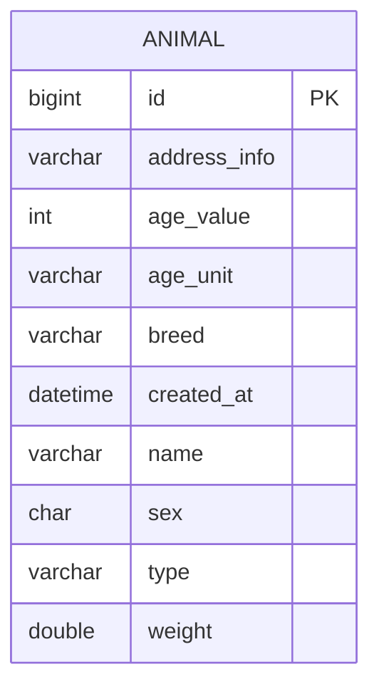

<p align="center">
  
  
  

  
</p>
<h1 align="center">🐶 Sistema de Cadastro de Animais 🐱</h1>

## ℹ️ Sobre o Projeto
Aplicação desenvolvida com Spring Boot para gerenciar os cadastro de animais de um abrigo. Para criar um cadastro é preciso preencher o formulário (nome, tipo, sexo, endereço onde foi encontrado, idade, peso e raça).

O sistema utiliza o Spring Data JPA para implementar as funcionalidades CRUD no banco de dados MySQL, armazenando os dados dos animais. A interface foi projetada para funcionar via CLI (Interface de Linha de Comando) através de um menu interativo.

O Docker cria um container da aplicação, permitindo a sua execução mesmo em máquinas que não possuam Java e/ou MySQL instalados.

### 🎬 Demonstração


(Essa seção será atualizada com uma demonstração do menu assim que a versão 2.0 estiver pronta)

### ✨ Funcionalidades do Sistema

- Cadastrar novo animal
- Listar todos os animais ou filtrar por critérios
- Atualizar um cadastro
- Excluir um cadastro

### 📄 Formulário de cadastro
| Campo                |          Descrição           | Exemplo                 | 
|:---------------------|:----------------------------:|:------------------------|
| **Nome**             |        Nome do animal        | Caramelo                |
| **Tipo**             |       Gato ou Cachorro       | Cachorro                |
| **Sexo**             |        Sexo do animal        | M                       |
| **Endereço**         | Onde o animal foi encontrado | Rua Abc, 123, São Paulo |
| **Idade**            |   Valor da idade estimada    | 4                       |
| **Unidade da Idade** |    Idade em meses ou anos    | anos                    |
| **Peso**             |          Peso em kg          | 9.8                     |
| **Raça**             |      Raça predominante       | SRD                     |

### 🗃️ Arquitetura do banco de dados


### 📂 Estrutura do Projeto
```text
.
├── init
├── logs
├── src/
│   └── main/
│       ├── java/
│       │   └── shelter/
│       │       └── animal/
│       │           ├── config/         # Classes de configurações
│       │           ├── controller/     # Valida requisições e envia para o Service
│       │           ├── dto/            # Objetos de transferência de dados (Request/Response)
│       │           ├── exceptions/     # Exceções do Sistema
│       │           ├── mapper/         # Mappers
│       │           ├── menu/           # Menus da aplicação
│       │           ├── models/         # Entidades JPA e Enumerações
│       │           ├── repository/     # Comunicação com o banco de dados
│       │           ├── service/        # Aplica regra de negócios e envia para o Repository
│       │           ├── utils/          # Classes utilitárias
│       │           └── Main.java       # Inicialização da aplicação
│       └── resources/                  # Arquivos de configuração dos perfis e logs
├── compose.yaml                        # Organização dos containers
├── Dockerfile                          # Criação da imagem da aplicação
├── entrypoint.sh                       # Script: Limpa o terminal e inicia a aplicação
├── pom.xml                             # Dependências do Maven
├── .envTemplate                        # Template das variáveis de ambiente
├── .dockerignore                       # Exclusão de arquivos desnecessários na imagem Docker
├── .gitignore
└── README.md
```

### 🛠️ Tecnologias e ferramentas
**Linguagem:** Java 21

**Framework:** Spring Boot 3

**Persistência:** Spring Data JPA / Hibernate

**Banco de dados:** MySQL 8

**Infraestrutura:** Docker & Docker Compose

**Padrão de Camadas:** Controller, Service, Repository e Entity

## 🚀 Executando a Aplicação
### 💻️ Pré-requisitos
- **Docker** para containerizar a aplicação.
- **Git** para clonar o repositório.

---
1. **Clone o repositório**
```
git clone https://github.com/alineaos/sistema-cadastro-animais.git
```

2. **Navegue até a pasta do repositório**
```
cd sistema-cadastro-animais
```

3. **Construa a imagem da aplicação**
```
docker compose build
```

4. **Execute a aplicação**
```
docker compose run --rm app
```
```--rm``` permite o uso do CLI da aplicação

---

### Projeto proposto por Lucas Carrilho - [@devmagro](https://www.linkedin.com/in/karilho/)

[Link original](https://github.com/karilho/desafioCadastro)
