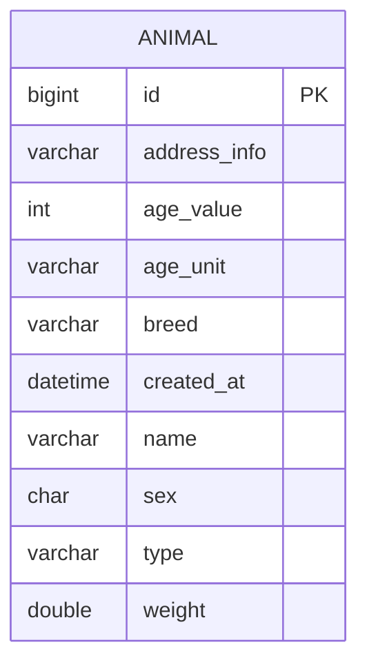

<p align="center">
  
  
  

  
</p>
<h1 align="center">🐶 Sistema de Cadastro de Animais 🐱</h1>

## ℹ️ Sobre o Projeto

Aplicação desenvolvida com **Spring Boot** para gerenciar os cadastros de animais de um abrigo. Para criar um cadastro,
o usuário deve preencher um formulário com nome, tipo, sexo, endereço onde foi encontrado, idade, peso e raça.

O sistema utiliza o **Spring Data JPA** para implementar as funcionalidades CRUD no banco de dados **MySQL**,
armazenando os dados dos animais. A interface foi projetada para funcionar via **CLI** (Interface de Linha de Comando)
através de um menu interativo.

O **Docker** cria um container da aplicação, permitindo a sua execução mesmo em máquinas que não possuam Java e/ou MySQL
instalados.

### 📌 Principais mudanças (v1.0 vs v2.0)

- Adicionado Spring Boot.
- Persistência de dados em um banco de dados SQL.
- Uso de **DTOs** e **Mappers** para proteger as entidades do sistema durante o transporte de dados.
- Containerização da aplicação com Docker.

### 🎬 Demonstração


### ✨ Funcionalidades do Sistema

- Cadastrar novo animal.
- Listar todos os animais ou filtrar por critérios específicos.
- Atualizar um cadastro.
- Excluir um cadastro.

### 📄 Formulário de cadastro

| Campo                |          Descrição           | Exemplo                 | 
|:---------------------|:----------------------------:|:------------------------|
| **Nome**             |        Nome do animal        | Caramelo                |
| **Tipo**             |       Gato ou Cachorro       | Cachorro                |
| **Sexo**             |        Sexo do animal        | M                       |
| **Endereço**         | Onde o animal foi encontrado | Rua Abc, 123, São Paulo |
| **Idade**            |   Valor da idade estimada    | 4                       |
| **Unidade da Idade** |    Idade em meses ou anos    | anos                    |
| **Peso**             |          Peso em kg          | 9.8                     |
| **Raça**             |      Raça predominante       | SRD                     |

> Notas sobre os campos:
> - Se **Nome**, **Número do Endereço** e **Raça** forem deixados em branco, serão salvos como "Não informado" no banco de dados.
> - Se **Idade**, **Unidade da Idade** e **Peso** forem deixados em branco, serão salvos como ```NULL``` no banco de dados, mas exibidos para o usuário como "Não informado".

### 🗃️ Arquitetura do banco de dados



### 📂 Estrutura do Projeto

```text
.
├── init
├── logs
├── src/
│   └── main/
│       ├── java/
│       │   └── shelter/
│       │       └── animal/
│       │           ├── config/         # Classes de configurações
│       │           ├── controller/     # Validação de requisições
│       │           ├── dto/            # Objetos de transferência de dados (Request/Response)
│       │           ├── exceptions/     # Exceções customizadas do Sistema
│       │           ├── mapper/         # Mappers
│       │           ├── menu/           # Menus da aplicação
│       │           ├── models/         # Entidades JPA e Enumerações
│       │           ├── repository/     # Comunicação com o banco de dados
│       │           ├── service/        # Regras de negócio do sistema
│       │           ├── utils/          # Classes utilitárias
│       │           └── Main.java       # Inicialização da aplicação
│       └── resources/                  # Arquivos de configuração dos perfis e logs
├── compose.yaml                        # Organização dos containers
├── Dockerfile                          # Criação da imagem da aplicação
├── entrypoint.sh                       # Script: Limpa o terminal e inicia a aplicação
├── pom.xml                             # Dependências do Maven
├── .envTemplate                        # Template das variáveis de ambiente
├── .dockerignore                       # Exclusão de arquivos desnecessários na imagem Docker
├── .gitignore
└── README.md
```

### 🛠️ Tecnologias e ferramentas

**Linguagem:** Java 21

**Framework:** Spring Boot 3

**Persistência:** Spring Data JPA / Hibernate

**Banco de dados:** MySQL 8

**Infraestrutura:** Docker & Docker Compose

**Padrão de Camadas:** Arquitetura em camadas (Controller, Service, Repository e Entity)

## 🚀 Executando a Aplicação

### 💻️ Pré-requisitos

- **Docker** para containerizar a aplicação.
- **Git** para clonar o repositório.

---

1. **Clone o repositório**

```
git clone https://github.com/alineaos/sistema-cadastro-animais.git
```

2. **Navegue até a pasta do repositório**

```
cd sistema-cadastro-animais
```

3. **Renomeie o arquivo ```.envTemplate``` para ```.env``` e defina as suas credenciais**

```
ENV_ROOT_USER=seu_root_user
ENV_ROOT_PASSWORD=seu_root_password
ENV_MYSQL_USER=seu_mysql_user
ENV_MYSQL_PASSWORD=seu_mysql_password
```

4. **Construa a imagem da aplicação**

```
docker compose build
```

5. **Execute a aplicação**

```
docker compose run --rm app
```

(```--rm``` é essencial para permitir a interatividade com a interface CLI da aplicação.)

### ⚙️ Perfis de configuração

Por padrão, o ```compose.yaml``` está configurado para o modo de **produção** (```SPRING_PROFILES_ACTIVE=prod```).

Para executar no modo **desenvolvedor**, altere a variável no ```compose.yaml```.

```
    environment:
      - SPRING_PROFILES_ACTIVE=dev
```

## 📜 Logs

A aplicação utiliza volumes do Docker para armazenar os logs, facilitando o seu monitoramento.

### 🔄 Visualização em Tempo Real

Para visualizar os logs em tempo real, abra o terminal de comandos e execute o comando correspondente ao seu sistema
operacional:

**Windows**

```
Get-Content logs\app-*.log -Wait
```

**Linux/macOS**

```
tail -f logs/app-*.log
```

### 📅 Visualização de uma Data Específica

Caso queira ver os logs de um dia específico, substitua ```*``` pela data desejada (formato ```AAAA-MM-DD```).

Exemplos:

**Windows**

```
Get-Content logs\app-2026-04-16.log
```

**Linux/macOS**

```
cat logs/app-2026-04-16.log
```

### 🔎 Filtragem por nível

Os logs do sistema estão divididos em três níveis: ```INFO```, ```WARN``` e ```ERROR```.

Para visualizar apenas um ou dois níveis, é preciso utilizar um filtro como nos exemplos abaixo (que estão exibindo
apenas ```WARN``` e ```ERROR```).

**Windows**

```
Get-Content logs\app-*.log -Wait | Select-String "WARN|ERROR"
```

**Linux/macOS**

```
grep -E "WARN|ERROR" logs/app-*.log
```

---

## 🔮 Futuras implementações

- Implementação de testes unitários (JUnit/Mockito)
- Implementação de testes de integração
- Desenvolvimento de uma interface gráfica (Front-end)
- Controle de acesso e segurança com **Spring Security**

### Projeto proposto por Lucas Carrilho - [@devmagro](https://www.linkedin.com/in/karilho/)

[Link original](https://github.com/karilho/desafioCadastro)
